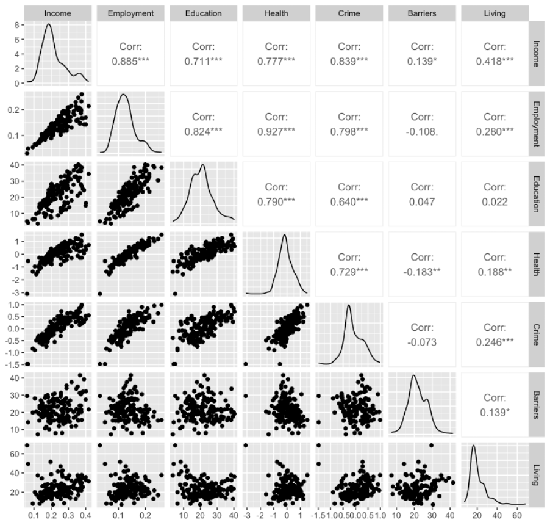
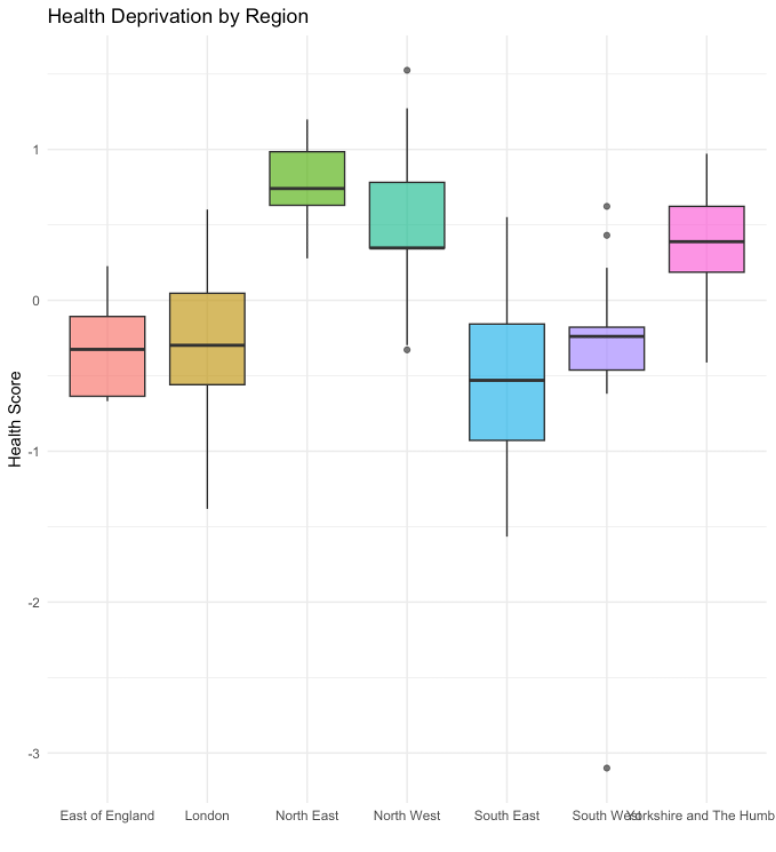
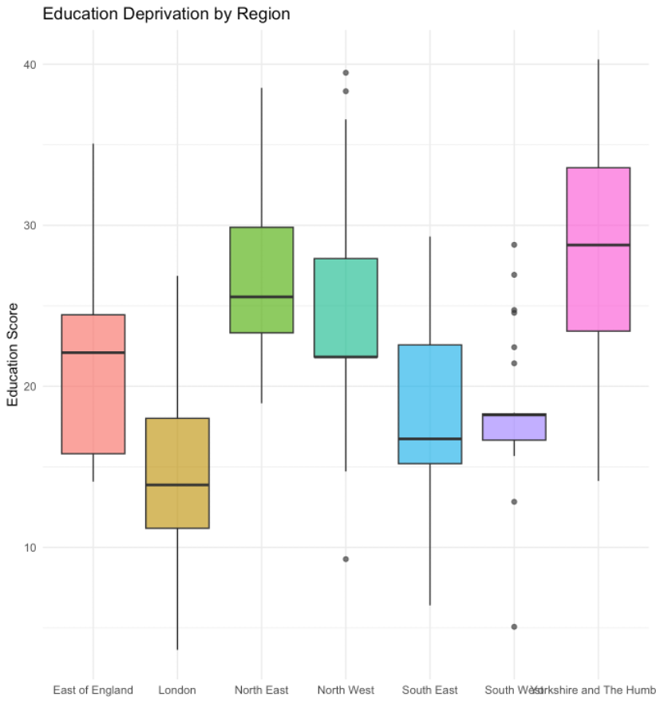
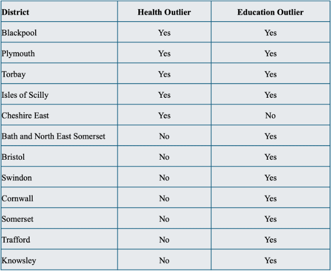
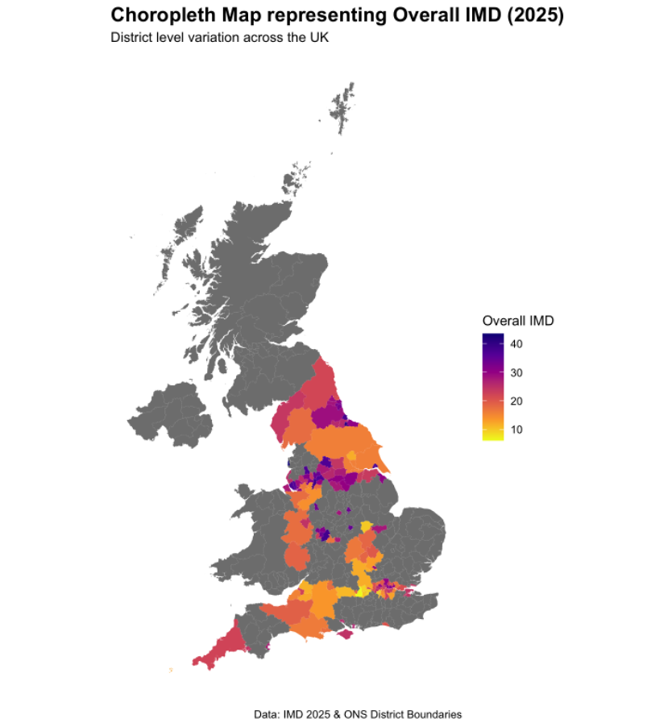

# 📊 Socioeconomic Deprivation Analysis in England

*Exploring socioeconomic deprivation across England using statistical modelling, multivariate analysis and spatial visualisation.*

## 📌 Project Overview

This repository investigates patterns of socioeconomic deprivation across England using the 2025 English Indices of Multiple Deprivation (IMD) dataset.

Rather than focusing on a single analytical technique, the project applies a range of statistical and machine learning methods to understand how deprivation varies geographically, identify relationships between deprivation domains and build predictive models capable of explaining overall deprivation.

The repository combines collaborative exploratory analysis with an individual statistical modelling investigation to provide a comprehensive end-to-end data analysis project.

## 👤 My contribution
Data preparation, exploratory data analysis, regional comparisons and spatial analysis (Questions 1, 2 and 5).

## 🎯 Objectives
- Clean and augment the IMD dataset.
- Explore relationships between deprivation domains.
- Compare deprivation across English regions.
- Apply Principal Component Analysis (PCA).
- Perform hierarchical clustering.
- Visualise deprivation geographically.
- Develop linear regression models to predict overall deprivation.

## 🛠 Technologies Used
- R
- dplyr
- ggplot2
- GGally
- cluster
- factoextra
- sf

## 📈 Analytical Techniques

This project demonstrates:

- Exploratory Data Analysis
- Correlation Analysis
- Principal Component Analysis (PCA)
- Hierarchical Clustering
- Linear Regression
- Best Subset Selection
- Akaike Information Criterion (AIC)
- Regression Diagnostics
- Geographic Information Systems (GIS)
- Choropleth Mapping
- 👥 Group Investigation

*The collaborative component focused on understanding deprivation patterns through exploratory analysis and multivariate techniques.*

## 🔍 Exploratory Data Analysis

The scatter matrix was used to examine relationships between the seven IMD deprivation domains.

## 📈 Regional Comparison

Health and Education were selected for further investigation because they showed the clearest separation between northern and southern districts.

### Health Deprivation

### Education Deprivation

## Districts Identified as Outliers

The table below summarises the districts identified as statistical outliers during the Health and Education deprivation analyses.

## 🗺️ Spatial Analysis

The choropleth map illustrates how Overall deprivation varies geographically across England.

**Highlights include:**

- Dataset augmentation
- Regional comparisons
- PCA
- Hierarchical clustering
- Spatial mapping

## 👩 Individual Investigation

*The individual component focused on predictive statistical modelling.*

**Highlights include:**

- Best subset regression
- Model comparison
- AIC
- Regression diagnostics
- Outlier investigation
- London-specific modelling

## 📄 Reports
This repository contains both the collaborative investigation and the individual regression analysis completed as part of this project.

- 📘 **Exploratory Analysis Report (Group Investigation)**  
  [View Report](english-deprivation-analysis/reports/Exploratory_Analysis_Report.pdf)

- 📙 **Linear Regression Analysis Report (Individual Investigation)**  
  [View Report](english-deprivation-analysis/reports/Individual_Regression_Analysis_Report.pdf)

## 📊 Key Findings

- Strong relationships exist between Income, Employment, Education and Health deprivation.
- PCA showed that deprivation can largely be explained by a small number of underlying dimensions.
- Hierarchical clustering identified meaningful groups of districts with similar deprivation profiles.
- Choropleth mapping highlighted clear geographical clustering of deprivation across England.
- Linear regression models explained over 98% of the variation in overall deprivation using only four predictors.

## 💭 What I Learned

This project showed me that real-world data science rarely relies on a single analytical technique. By combining exploratory analysis, multivariate statistics, spatial visualisation and predictive modelling, I developed a much deeper understanding of how different methods complement one another when investigating complex socioeconomic problems.

## 🚀 Future Improvements
- Compare multiple clustering algorithms.
- Explore non-linear predictive models.
- Incorporate census variables.
- Develop an interactive dashboard.
- Analyse changes over time.

## 🌍 About the Author

Hi, I'm **Mia Emanuele**.

I'm a **Data Scientist** with a passion for statistical modelling, machine learning and explainable AI.

I enjoy **finding the "why" behind the data**—using data to uncover patterns, explain complex systems and support better decisions.

This repository forms part of my professional portfolio, showcasing projects completed during my MSc that have since been refined and expanded to demonstrate both technical expertise and analytical thinking.

### Connect with me

💼 LinkedIn: www.linkedin.com/in/mia-emanuele

💻 GitHub: https://github.com/miaemanuele77-ds

---

⭐ Thank you for taking the time to explore my work.

Feedback, discussion and collaboration are always welcome.
